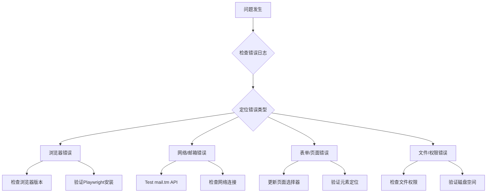

# 故障排除手册

## 快速诊断流程



## 常见错误及解决方案

### 1. 浏览器相关错误

#### Playwright安装问题

**错误信息**:
```
Looks like Playwright was just installed or updated
```

**解决方案**:
```bash
# 安装浏览器
playwright install chromium

# 验证安装
playwright install --dry-run
```

#### Chrome启动失败

**错误信息**:
```
wandb-registrar.InsecureCertificateVerificationError: Certificate verification failed
```

**解决方案**:
```bash
# 安装浏览器证书
sudo apt update
sudo apt install ca-certificates fonts-liberation libasound2 libatk-bridge2.0-0 libgtk-3-0
```

### 2. 邮件服务错误

#### Mail.tm连接超时

**错误信息**:
```
requests.exceptions.Timeout: HTTPSConnectionPool
```

**诊断步骤**:
```python
# 测试mail.tm连通性
curl -v https://mail.tm/
curl -v https://api.mail.tm/
```

#### 临时邮箱创建失败

**错误信息**:
```
AccountResponseError: Domain not found or unavailable
```

**解决方案**:
1. 更换邮箱域名
2. 检查网络代理设置
3. 查看可用域名：

```python
# 可用域名列表
python -c "import requests; print([d['domain'] for d in requests.get('https://api.mail.tm/domains').json()['hydra:member']])"
```

### 3. 验证码问题

#### 图像验证码出现

**错误信息**:
```
Recaptcha.Show - unable to continue registration
```

**应急解决方案**:
```bash
# 切换IP地址方式
# 使用VPN或代理服务
# 等待一段时间再尝试
```

#### 简易验证问题

**错误信息**:
```
type the characters shown above: xxxx
```

**处理脚本**:
```python
# 在 browser_service.py 添加验证码处理
import pytesseract
from PIL import Image

def solve_simple_captcha(image_element):
    """简单的验证码识别"""
    if image_element:
        screenshot = image_element.screenshot()
        captcha_text = pytesseract.image_to_string(screenshot)
        return captcha_text.strip()
```

### 4. 系统相关错误

#### X11转发问题

**错误信息**:
```
Unable to open X display
```

**Linux/WSL解决方案**:
```bash
# 安装xserver
sudo apt install xvfb

# 创建虚拟显示
export DISPLAY=:99
Xvfb :99 -screen 0 1024x768x24 > /dev/null 2>&1 &
```

#### 文件权限问题

**错误信息**:
```
PermissionError: [Errno 13] Permission denied
```

**修复权限**:
```bash
chmod +x run.sh
chmod +x wandb-registrar/
chown -R $USER:$USER .
```

### 5. 网络连接错误

#### DNS解析失败

**错误信息**:
```
urllib3.exceptions.MaxRetryError: DNS resolution failed
```

**解决方案**:
```bash
# 修改DNS设置
sudo vi /etc/resolv.conf
# 添加：nameserver 8.8.8.8
```

#### 代理配置

**错误信息**:
```
Connection timeout to mail.tm
```

**代理设置**:
```python
# 在 settings.py 中添加
def setup_proxy():
    return {
        'http': 'http://proxy.server:8080',
        'https': 'https://proxy.server:8080'
    }
```

## 调试工具集

### 1. 日志分析工具

创建 `diagnostic.py`：

```python
import re
import json
from datetime import datetime

def analyze_log_file(log_file='logs/app.log'):
    """分析日志文件并生成诊断报告"""
    errors = []
    warnings = []
    
    with open(log_file, 'r') as f:
        for line_num, line in enumerate(f, 1):
            if 'ERROR' in line:
                errors.append({'line': line_num, 'content': line.strip()})
            elif 'WARNING' in line:
                warnings.append({'line': line_num, 'content': line.strip()})
    
    return {
        'total_errors': len(errors),
        'total_warnings': len(warnings),
        'errors': errors,
        'warnings': warnings,
        'timestamp': datetime.now().isoformat()
    }

if __name__ == "__main__":
    report = analyze_log_file()
    print(json.dumps(report, indent=2, ensure_ascii=False))
```

### 2. 网络连接测试

```bash
#!/bin/bash
# network_test.sh

services=("https://mail.tm" "https://wandb.ai" "https://api.mail.tm")

echo "=== 网络连接测试 ==="
for service in "${services[@]}"; do
    if curl -s "$service" > /dev/null; then
        echo "✅ $service - 正常"
    else
        echo "❌ $service - 连接失败"
    fi
done

# 测试端口
echo "=== 端口检查 ==="
netstat -tlnp | grep :80 || echo "HTTP服务未运行"
```

### 3. 浏览器健康检查

```python
# browser_health_check.py
from playwright.sync_api import sync_playwright
import time

def check_browser_health():
    """检查浏览器环境健康状态"""
    try:
        with sync_playwright() as p:
            browser = p.chromium.launch()
            page = browser.new_page()
            
            # 测试基本页面加载
            response = page.goto("https://example.com")
            load_time = time.time()
            
            # 测试JavaScript执行
            page.evaluate('1 + 1')
            
            browser.close()
            return {
                'status': 'healthy',
                'http_code': response.status,
                'load_time': time.time() - load_time
            }
    except Exception as e:
        return {
            'status': 'error',
            'message': str(e)
        }

if __name__ == "__main__":
    print(check_browser_health())
```

## 故障排除清单

### 运行前检查
- [ ] Python 3.8+ installed
- [ ] Chromium browsers installed (`playwright install chromium`)
- [ ] Internet connection active
- [ ] Ports 80/443 accessible
- [ ] Sufficient disk space (>100MB)

### 首次运行检查
- [ ] Initial test run successful
- [ ] Logs generated without errors
- [ ] Output files created (`auth.txt`, `key.txt`)
- [ ] Screenshot captured successfully

### 定期维护检查
- [ ] Check logs for accumulated errors
- [ ] Update browser selectors as needed
- [ ] Verify mail.tm API responsiveness
- [ ] Check credential file integrity

## 紧急恢复程序

### 快速重置

```bash
#!/bin/bash
# reset_service.sh

echo "服务快速重置..."

# 停止进程
pkill -f "python main.py"
pkill -f "chromium"

# 清理日志
echo "" > logs/app.log

# 检查环境
python -c "import playwright; print('Playwright OK')"
python -c "import sys; print(f'Python {sys.version}')"

# 重新运行
nohup ./run.sh > output.log 2>&1 &
echo "服务已重启，请查看日志: tail -f output.log"
```

### 完整重装

```bash
# 备份现有数据
cp -r wandb-registrar/ backup-wandb-$(date +%Y%m%d)/

# 清理环境
rm -rf __pycache__ logs/*.log .venv/

# 重新安装
python -m venv .venv
source .venv/bin/activate
pip install -r requirements.txt
playwright install chromium

# 重新测试
python test_workflow.py
```

## 支持联系方式

### 问题报告指南
1. 收集完整的错误日志
2. 提供系统环境信息
3. 包含重现步骤
4. 提供浏览器版本信息

### 必备信息模板

创建问题时包含：

```markdown
## 环境信息
- OS: [Ubuntu 20.04/WSL/Windows 10]
- Python: [3.9.7]
- Playwright: [1.40.0]
- last successful run: [timestamp]

## 错误日志
[粘贴完整的错误信息]

## 重现步骤
1. [第一步]
2. [第二步]
...
```